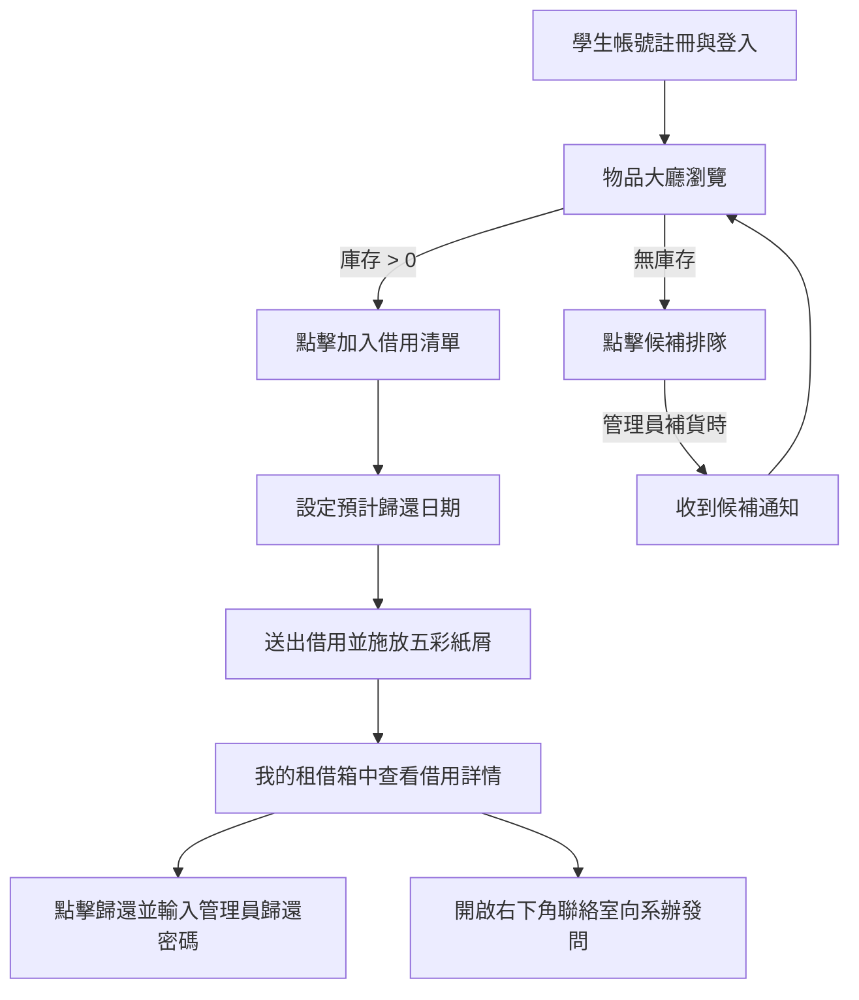
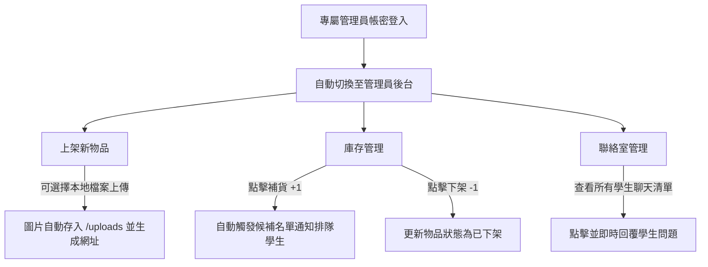

# 🎓 校園物品借用系統 (Campus Borrow System)

> 一款為大專院校打造的現代化、智慧化、遊戲化校園物品借用管理平台。結合完整的信用積分機制、多角色（學生與管理員）權限分開、即時通知系統與聯絡室聊天功能。前端採用 Vanilla CSS 手工打造極致的「流動玻璃 (Liquid Glass)」微電商質感，後端則以 Express + SQLite 提供高效可靠的 API 服務。

> 💡 **圖片放置預留區**：``
> *（請在此路徑補上首頁展示圖片，以展現毛玻璃視覺效果）*

---

## 📑 目錄
1. [專案簡介與技術棧 (Tech Stack)](#1-專案簡介與技術棧-tech-stack)
2. [目錄結構說明 (Project Structure)](#2-目錄結構說明-project-structure)
3. [快速啟動指南 (Getting Started)](#3-快速啟動指南-getting-started)
4. [核心業務邏輯與資料流 (Core Architecture & Data Flow)](#4-核心業務邏輯與資料流-core-architecture--data-flow)
5. [進階功能與程式碼範例 (Advanced Features & Code Examples)](#5-進階功能與程式碼範例-advanced-features--code-examples)
6. [版面設計與 UI/UX 質感升級 (UI/UX Upgrades)](#6-版面設計與-uiux-質感升級-uiux-upgrades)
7. [使用者完整流程與體驗考量 (User Journey)](#7-使用者完整流程與體驗-user-journey)
8. [前後端分離部署方案與實務解決方案 (Deployment & Troubleshoot)](#8-前後端分離部署方案與實務解決方案-deployment--troubleshoot)

---

## 1. 專案簡介與技術棧 (Tech Stack)

本系統**完全符合前後端分離 (Frontend-Backend Separation)** 之作業規範，將 `/server` 與 `/client` 完全獨立。後端僅作為純 API 伺服器 (API Only)，不進行任何網頁渲染，只回傳純 JSON 資料。

### ⚙️ 後端 (Backend - `/server`)
- **Node.js & Express.js**：使用純 API 路由，作為後端伺服器的核心。
- **SQLite3 (`5.1.6`)**：輕量級本地端關聯式資料庫，便於進行資料庫管理與移交。
- **Multer**：本地上傳套件，用於管理員上架物品時的本地圖片實體上傳。
- **JWT (jsonwebtoken) & bcryptjs**：負責無狀態的角色權限身分驗證與密碼加密。

### 🎨 前端 (Frontend - `/client`)
- **Vue 3 (Composition API) & Vite**：前衛且極速的前端開發體驗，利用響應式系統處理資料狀態。
- **Axios**：統一處理與後端雲端 API 的 RESTful 請求。
- **canvas-confetti**：在借用或歸還成功時提供精緻的五彩紙屑轉場特效。
- **Vanilla CSS**：捨棄第三方框架（如 TailwindCSS），完全手寫現代毛玻璃（Glassmorphism）與微電商卡片式 (Card) 排版。

---

## 2. 目錄結構說明 (Project Structure)

核心專案結構圖如下，已排除本地暫存與相依資料夾：

```text
/campus-borrow-system
├── /server                 ← Express 後端 API 目錄
│   ├── /uploads            ← 上傳物品圖片實體儲存目錄
│   ├── database.db         ← SQLite 本地端實體資料庫
│   ├── package.json        ← 後端依賴配置 (含 sqlite3 相容性 overrides)
│   └── server.js           ← 後端 API 入口 (包含權限管理、聯絡室與通知 API)
│
├── /client                 ← Vue 3 前端目錄
│   ├── index.html          ← 靜態載入點
│   ├── package.json        ← 前端依賴配置
│   ├── vite.config.js      ← Vite 構建配置 (設定 base 路徑以符合 GitHub Pages)
│   └── /src
│       ├── App.vue         ← 前端主入口 (包含視圖切換與大部分 API 邏輯)
│       ├── main.js         ← Vue 初始化入口 (設定 Axios baseURL)
│       ├── style.css       ← 全域毛玻璃樣式與過渡動畫設定
│       ├── /components     ← 元件庫
│       │   ├── ItemCard.vue         ← 物品卡片展示元件
│       │   ├── ItemDetailsModal.vue ← 評論與詳情互動彈窗
│       │   └── Toast.vue            ← 自訂全域通知元件
│       └── /composables    
│           └── useToast.js          ← 輕量化通知邏輯
│
├── /.github/workflows      ← GitHub Actions CI/CD 目錄
│   ├── deploy-frontend.yml          ← 前端自動發布至 GitHub Pages 工作流
│   └── main_tea-price-tracker-d1321322.yml ← 後端自動部署至 Azure App Service 工作流
└── README.md               ← 您目前正在閱讀的這份說明文件
```

---

## 3. 快速啟動指南 (Getting Started)

### 步驟 1：本地啟動後端伺服器 (Server)
```bash
cd server
npm install
npm run dev
# 後端伺服器將預設在 http://localhost:3000 運行
```

### 步驟 2：本地啟動前端客戶端 (Client)
```bash
cd client
npm install
npm run dev
# 前端伺服器將在本地啟動，可直接點擊 http://localhost:5173 開啟網頁
```

---

## 4. 核心業務邏輯與資料流 (Core Architecture & Data Flow)

### 🧩 前端元件構成解析 (Component Composition)
本網站採「單頁應用程式 (SPA)」架構，以 `App.vue` 管理 `items`、`cart`、`myRecords` 與 `userRole` 等核心狀態，並將組件解耦。

#### 1. 物品展示卡片 (`ItemCard.vue`)
*   **用途**：渲染單個物品的圖片、分類、借出狀態與庫存，並提供「加入清單」或「候補排隊」功能。
*   **Emits 傳遞**：當使用者點擊加入清單或查看詳情時，透過 Vue 的 `emit` 向上傳送事件，由父組件 `App.vue` 進行狀態更新。

```vue
<!-- client/src/components/ItemCard.vue 程式碼解析 -->
<template>
  <div class="card-item" :class="{ 'card-unavailable': item.total_quantity <= item.borrowed_quantity }">
    <div class="image-container">
      
    </div>
    <div class="card-body">
      <span class="category-tag">{{ item.category }}</span>
      <h3>{{ item.name }}</h3>
      <p class="description">{{ item.description }}</p>
      
      <!-- 庫存判斷：有庫存顯示加入借用，無庫存則顯示排隊候補 -->
      <div class="action-section">
        <button 
          v-if="item.total_quantity - item.borrowed_quantity > 0"
          @click="$emit('add-to-cart', item)" 
          class="btn-action"
        >
          加入借用清單
        </button>
        <button 
          v-else 
          @click="$emit('join-waitlist', item)" 
          class="btn-action btn-waitlist"
        >
          排隊候補
        </button>
      </div>
    </div>
  </div>
</template>
```

#### 2. 自訂全域通知系統 (`Toast.vue` & `useToast.js`)
*   **用途**：替代瀏覽器原生會阻塞線程的 `alert()`，提供平滑淡入淡出、非侵入式的毛玻璃質感通知。

```javascript
// client/src/composables/useToast.js 程式碼解析
import { ref } from 'vue';
const toasts = ref([]);
let toastId = 0;

export function useToast() {
  const showToast = (message, type = 'info', duration = 3000) => {
    const id = toastId++;
    toasts.value.push({ id, message, type });
    // 依設定時間自動移除通知
    setTimeout(() => {
      toasts.value = toasts.value.filter(t => t.id !== id);
    }, duration);
  };
  return {
    toasts,
    success: (msg) => showToast(msg, 'success'),
    error: (msg) => showToast(msg, 'error'),
    warning: (msg) => showToast(msg, 'warning')
  };
}
```

> 💡 **圖片放置預留區**：``

---

## 5. 進階功能與程式碼範例 (Advanced Features & Code Examples)

### 🚪 多角色登入與視圖隔離 (Role-based Views)
為了將「學生（租借方）」與「管理員（出租方）」徹底隔開，後端回傳 JWT 時會包含使用者的 `role`。前端收到後將其寫入 `localStorage`，並動態改變 `currentView`。

#### 1. 前端視圖過濾與登入跳轉
```javascript
// client/src/App.vue 程式碼解析
const userRole = ref(localStorage.getItem('role') || 'student');
const currentView = ref(token.value ? (userRole.value === 'admin' ? 'admin' : 'gallery') : 'auth');

const handleAuth = async () => {
  try {
    const response = await axios.post('/api/auth/login', {
      username: authForm.value.username,
      password: authForm.value.password
    });
    if (response.data && response.data.success) {
      token.value = response.data.token;
      userRole.value = response.data.user.role || 'student';
      
      // 根據角色決定首頁跳轉
      if (userRole.value === 'admin') {
        currentView.value = 'admin';
        fetchAdminItems(); // 獲取庫存列表
      } else {
        currentView.value = 'gallery'; // 學生進入物品大廳
      }
    }
  } catch (error) {
    toast.error('身分驗證失敗，請檢查帳號密碼');
  }
};
```

---

### 📦 管理員物品管理（支援本地圖片上傳與補貨通知）
管理員可以透過後台新增物品（支援上傳實體檔案並生成公網網址），或是調整庫存。當庫存補貨（+1）時，系統會自動搜尋該物品的候補名單，並向前排的第一位學生發送「候補通知」。

#### 1. 後端 Multer 上傳與補貨候補邏輯
```javascript
// server/server.js 程式碼解析 - 物品上架與補貨通知
const multer = require('multer');
const upload = multer({ dest: 'uploads/' });

// 1. 物品上架 API
app.post('/api/admin/items', authenticateToken, upload.single('image'), (req, res) => {
  if (req.user.role !== 'admin') return res.status(403).json({ success: false, message: '權限不足' });
  
  const { name, category, description, deposit, total_quantity, return_location } = req.body;
  // 解析本地圖片儲存路徑
  const image = req.file ? 'https://YOUR_AZURE_WEB_APP.azurewebsites.net/uploads/' + req.file.filename : req.body.image;

  db.run(`INSERT INTO items (name, category, image, description, deposit, total_quantity, borrowed_quantity, return_location, status) 
          VALUES (?, ?, ?, ?, ?, ?, 0, ?, 'available')`,
    [name, category, image, description, deposit, total_quantity, return_location],
    function(err) {
      if (err) return res.status(500).json({ success: false, message: '上架失敗' });
      res.json({ success: true, message: '上架成功' });
    }
  );
});

// 2. 補貨庫存更新 API（觸發候補通知）
app.put('/api/admin/items/:id', authenticateToken, (req, res) => {
  if (req.user.role !== 'admin') return res.status(403).json({ success: false, message: '權限不足' });
  const { total_quantity, status } = req.body;
  const itemId = req.params.id;

  db.get('SELECT name, total_quantity, borrowed_quantity FROM items WHERE id = ?', [itemId], (err, row) => {
    if (err || !row) return res.status(500).json({ success: false });
    
    const isRestock = total_quantity > row.total_quantity;
    
    db.run('UPDATE items SET total_quantity = ? WHERE id = ?', [total_quantity, itemId], (updateErr) => {
      if (updateErr) return res.status(500).json({ success: false });

      // 若有補貨，自動尋找候補第一名的學生並發送通知
      if (isRestock) {
        db.get('SELECT user_id FROM waitlists WHERE item_id = ? AND status = "waiting" ORDER BY id ASC LIMIT 1', [itemId], (waitErr, waitRow) => {
          if (!waitErr && waitRow) {
            const notifMsg = `您候補排隊的「${row.name}」已補貨，請盡速前往大廳借用！`;
            db.run('INSERT INTO notifications (user_id, title, message, created_at) VALUES (?, "候補通知", ?, ?)',
              [waitRow.user_id, notifMsg, new Date().toISOString()]);
            // 更新排隊狀態為已通知
            db.run('UPDATE waitlists SET status = "notified" WHERE user_id = ? AND item_id = ?', [waitRow.user_id, itemId]);
          }
        });
      }
      res.json({ success: true, message: '庫存更新成功' });
    });
  });
});
```

---

### 💬 雙向即時聯絡室 (Lessor-Student Chat Room)
聯絡室支援學生向特定歸還地（如系辦公室、課外活動組）發送即時詢問，管理員則能在後台查看所有與學生的對話並進行即時回覆。

#### 1. 前端聯絡室聊天介面邏輯
```javascript
// client/src/App.vue 程式碼解析 - 傳送聊天訊息
const sendChatMessage = async () => {
  if (!chatInput.value.trim() || !currentChatLessor.value) return;
  try {
    const payload = { 
      lessor_name: currentChatLessor.value, 
      content: chatInput.value, 
      target_user_id: chatTargetUserId.value // 若是管理員回信，需指定回給哪個學生
    };
    const res = await axios.post('/api/messages', payload, { 
      headers: { Authorization: `Bearer ${token.value}` } 
    });
    if (res.data.success) {
      chatMessages.value.push(res.data.message); // 動態塞入對話框
      chatInput.value = ''; // 清空輸入框
    }
  } catch(e) { 
    toast.error('發送失敗'); 
  }
};
```

> 💡 **圖片放置預留區**：``

---

## 6. 版面設計與 UI/UX 質感升級 (UI/UX Upgrades)

為了提供大專院校學生最高雅的質感，本專案在 CSS 設計上引入了多項高規格視覺細節：

### ✨ 左右分割質感登入 (Split Auth Layout)
*   左側為洗鍊的黑色調極簡品牌說明與登入表單，右側為四宮格的精緻校園物品輪播展示。
*   輸入框拋棄傳統的矩形邊框，使用純下底線（Underline Input）搭配 Focus 時的平滑拉伸邊框動畫。

### ✨ 流動玻璃質感 (Glassmorphism)
*   全站彈窗（Modal）、購物車側邊欄與 Toast 均使用了 `backdrop-filter: blur(16px)` 與半透明背景色，產生高級通透感。

```css
/* client/src/style.css 程式碼解析 */
.glass-panel {
  background: rgba(255, 255, 255, 0.75);
  backdrop-filter: blur(16px);
  -webkit-backdrop-filter: blur(16px);
  border: 1px solid rgba(255, 255, 255, 0.4);
  box-shadow: 0 20px 40px rgba(0, 0, 0, 0.04);
}
```

---

## 7. 使用者完整流程與體驗 (User Journey)

### 🧑‍🎓 學生流程 (Student Journey)


### 🧑‍💼 管理員流程 (Admin Journey)


---

## 8. 前端與後端分離部署方案 (Deployment & Troubleshoot)

為了解鎖高併發潛力、並確保網頁加載速度，我們採用了**前後端完全分離部署**的現代化雲端託管方案。

| 部署項目 | 託管平台 | 部署方式 | 為什麼這樣做？ |
| :--- | :--- | :--- | :--- |
| **前端客戶端 (`/client`)** | **GitHub Pages** | GitHub Actions 靜態自動化建置 (Deploy to Pages) | Vue 打包後為純靜態檔案，託管在 GitHub Pages 可以享有**免費、極速 (CDN 支援) 且零維護成本**的優勢。 |
| **後端伺服器 (`/server`)** | **Azure App Service** | GitHub Actions 雲端自動發布 (ZIP Deploy via OIDC) | 提供 Linux 執行環境，負責 Express 服務的持續運作與 SQLite 檔案的動態讀寫，並自動配置 SSL 憑證。 |

---

### 🛠️ 實務部署踩坑與排錯記錄 (Troubleshooting)

在 GitHub Actions 的 CI/CD 流程中，我們解決了多項重大的底層部署錯誤，以下為排錯全記錄：

#### 1. SQLite 引起的 `GLIBC_2.38` 找不到崩潰錯誤
*   **問題描述**：GitHub Actions 在最新的 Ubuntu (GLIBC 2.38) 上跑 `npm install` 並把 `node_modules` 包裹上傳到 Azure。但 Azure 的 Linux 伺服器底層系統庫較舊（不支援 GLIBC 2.38），導致後端啟動時載入 sqlite3 二進位模組直接崩潰。
*   **解決方法**：
    1.  將 `server/package.json` 中的 `sqlite3` 版本指定為向下相容性更好的 `"5.1.6"`。
    2.  在打包時利用 `npm install --platform=linux --arch=x64` 強制在 CI 階段下載 Linux 相容的預編譯檔。
    3.  透過 `env` 注入淘寶的 `SQLITE3_BINARY_HOST_MIRROR` 鏡像網址，避開新版 npm config set 選項嚴格校驗所導致的建置失敗。
    4.  *(終極解決方案)* 在打包 artifact 上傳至 Azure 時，**排除上傳本地 `node_modules`**。如此一來，Azure 接收到程式碼後，會透過其 Oryx 建置引擎在雲端伺服器本地自動執行 `npm install`。因為是在 Azure 伺服器本地編譯，下載的二進位模組保證與其 GLIBC 版本 100% 完美相容！

#### 2. 資料庫 `database.db` 被進程鎖定導致 rsync 部署中斷
*   **問題描述**：Azure 在同步（rsync）建置檔案至 `/home/site/wwwroot` 時，因為 GitHub Actions 將本地端測試的 `database.db` 一起打包上傳，而 Azure 上運行的 Express 後端此時正開著並鎖定該資料庫檔案，導致 `rsync` 替換失敗並回傳 `exit code 23`。
*   **解決方法**：
    在 [.github/workflows/main_tea-price-tracker-d1321322.yml](file:///.github/workflows/main_tea-price-tracker-d1321322.yml) 部署工作流中，將上傳路徑排除 `.db` 檔案，確保資料庫不會被重複上傳與覆蓋：
    ```yaml
          - name: Upload artifact for deployment job
            uses: actions/upload-artifact@v4
            with:
              name: node-app
              path: |
                ./server
                !./server/database.db
    ```

#### 3. GitHub Pages 開啟後只顯示 `README.md` 說明文件
*   **問題描述**：前端部署至 Pages 後，一打開網址顯示的竟是此 README 文件的 HTML，而非我們設計的物品借用網頁。
*   **解決方法**：這是因為 GitHub 專案預設的 Pages 來源設定為「從分支 (Deploy from a branch)」讀取根目錄。由於專案根目錄沒有 `index.html`，Pages 才會去讀取並渲染 `README.md`。必須手動前往 GitHub 倉庫頁面的 **Settings -> Pages -> Build and deployment -> Source** 下拉選單，將其改選為 **GitHub Actions**，如此一來 Pages 才會正確去抓取 Actions 打包好並上傳的前端 `./client/dist` 靜態網頁檔案。
